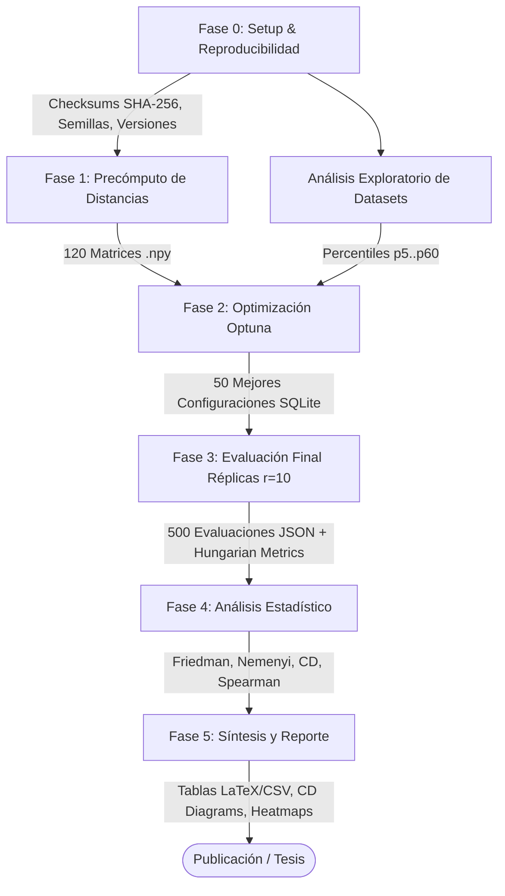

# MIClustering: Protocolo Experimental de Aprendizaje Multi-Instancia (MIL)

[](https://www.python.org/)
[](../lib-code/MIClustering)
[](https://optuna.org/)
[](./config.py)
[](./)

Este repositorio contiene el **banco de pruebas experimental completo, reproducible y estandarizado** para la comparación sistemática de algoritmos de **Aprendizaje Multi-Instancia (Multi-Instance Learning, MIL)** bajo diversas **métricas de distancia entre bolsas** y **estrategias de preprocesamiento/escalado**.

El marco experimental evalúa algoritmos basados en densidad (**MIDBSCAN**, **COSMIC**), basados en centroides/medoides (**MIKMeans**, **MIKMedoids**) y clasificadores supervisados basados en instancias/bolsas (**MIKnn**) sobre **10 datasets canónicos** de la literatura MIL.

---

## 📑 Tabla de Contenidos

1. [Objetivos y Preguntas de Investigación](#-objetivos-y-preguntas-de-investigación)
2. [Caracterización Exhaustiva de los Datasets](#-caracterización-exhaustiva-de-los-datasets)
   - [Estructura y Estadísticas Descriptivas](#estructura-y-estadísticas-descriptivas)
   - [Distribución de Clases y Ratio de Desbalance](#distribución-de-clases-y-ratio-de-desbalance)
   - [Análisis de Dominios y Complejidad Estructural](#análisis-de-dominios-y-complejidad-estructural)
   - [Código Clave: Extracción Estructural y Análisis de Distancias](#código-clave-extracción-estructural-y-análisis-de-distancias)
3. [Diseño Factorial y Espacio Experimental](#-diseño-factorial-y-espacio-experimental)
4. [Arquitectura del Pipeline y Fases del Protocolo](#-arquitectura-del-pipeline-y-fases-del-protocolo)
   - [Fase 0: Preparación y Control de Reproducibilidad](#fase-0-preparación-y-control-de-reproducibilidad-fase0_setuppy)
   - [Fase 1: Precómputo de Matrices de Distancia](#fase-1-precómputo-de-matrices-de-distancia-fase1_distanciaspy)
   - [Fase 2: Optimización de Hiperparámetros con Optuna](#fase-2-optimización-de-hiperparámetros-con-optuna-fase2_optunapy)
   - [Fase 3: Evaluación Final con Réplicas y Mapeo Húngaro](#fase-3-evaluación-final-con-réplicas-y-mapeo-húngaro-fase3_evaluacionpy)
   - [Fase 4: Análisis Estadístico Comparativo No Paramétrico](#fase-4-análisis-estadístico-comparativo-no-paramétrico-fase4_estadisticapy)
   - [Fase 5: Síntesis y Reporte de Resultados](#fase-5-síntesis-y-reporte-de-resultados-fase5_reportepy)
5. [Aceleración de Hardware y Estimación de Tiempos](#-aceleración-de-hardware-y-estimación-de-tiempos)
6. [Estructura de Directorios y Artefactos](#-estructura-de-directorios-y-artefactos)
7. [Guía de Ejecución Rápida y Completa](#-guía-de-ejecución-rápida-y-completa)

---

## 🎯 Objetivos y Preguntas de Investigación

El propósito principal es contrastar de forma justa (*fairness*), no sesgada y estadísticamente validada el comportamiento de los modelos de clustering y clasificación MIL cuando se combinan con diferentes formulaciones de métricas de distancia entre conjuntos.

### Preguntas de Investigación (Research Questions)

* **PI1 (Algoritmos):** ¿Existen diferencias estadísticamente significativas en el rendimiento de los 5 algoritmos MIL considerando el conjunto completo de datasets?
* **PI2 (Distancias):** ¿Qué métrica de distancia produce, en promedio, el mejor rendimiento por algoritmo y globalmente a través de todos los datasets?
* **PI3 (Escalado):** ¿El tipo de escalado (`MinMaxScaler` vs. `StandardScaler`) ejerce un efecto sistemático sobre la calidad del agrupamiento, o su impacto está condicionado por la métrica de distancia empleada?
* **PI4 (Consistencia Interna-Externa):** ¿Existe consistencia y correlación monótona entre los índices de validación interna de clusters (como el coeficiente de *Silhouette* sobre matrices de distancia precalculadas) y las métricas externas de concordancia respecto a la clase real (como *Hungarian Accuracy* y *Hungarian Macro-F1*)?

---

## 📊 Caracterización Exhaustiva de los Datasets

El benchmark integra **10 datasets canónicos** en formato ARFF que representan diversos dominios científicos y propiedades estructurales dispares (variabilidad en número de bolsas $N$, dimensionalidad $D$, número de instancias por bolsa $n_i$, y desbalance de clases).

Los datos han sido caracterizados mediante `analisis_datasets.py`, generando los artefactos [estructura_datasets.csv](file:///Users/Andres/Desktop/MI-DBSCAN/MIClustering-experiments/resultados/analisis_datasets/estructura_datasets.csv) y [distribucion_clases.json](file:///Users/Andres/Desktop/MI-DBSCAN/MIClustering-experiments/resultados/analisis_datasets/distribucion_clases.json).

### Estructura y Estadísticas Descriptivas

A continuación se resume la topología de los 10 conjuntos de datos ordenados por su dimensionalidad y cardinalidad:

| Dataset | Bolsas ($N$) | Features ($D$) | Instancias $\mu \pm \sigma$ | Min | Max | Mediana | Imbalance Ratio ($IR$) | Cota $k_{\max} = \lfloor\sqrt{N}\rfloor$ |
| :--- | :---: | :---: | :---: | :---: | :---: | :---: | :---: | :---: |
| **musk1** | 92 | 166 | $5.17 \pm 6.40$ | 2 | 40 | 4.0 | **0.9574** (Balanceado) | 9 |
| **musk2** | 102 | 166 | $64.69 \pm 174.80$ | 1 | 1044 | 12.0 | **0.6190** (Moderado) | 10 |
| **mutagenesis3_atoms** | 188 | 10 | $8.61 \pm 2.02$ | 5 | 15 | 8.0 | **0.5040** (Moderado) | 13 |
| **mutagenesis3_chains**| 188 | 24 | $28.45 \pm 10.16$ | 8 | 52 | 27.0 | **0.5040** (Moderado) | 13 |
| **BirdsChestnut-backedChickadee** | 548 | 38 | $18.67 \pm 7.88$ | 2 | 43 | 17.0 | **0.2715** (Desbalanceado) | 23 |
| **BirdsHammondsFlycatcher** | 548 | 38 | $18.67 \pm 7.88$ | 2 | 43 | 17.0 | **0.2315** (Desbalanceado) | 23 |
| **Harddrive1** | 369 | 61 | $185.40 \pm 120.86$ | 2 | 299 | 290.0 | **0.9319** (Balanceado) | 19 |
| **ImageElephant** | 200 | 230 | $6.96 \pm 2.49$ | 2 | 13 | 7.0 | **1.0000** (Perfecto) | 14 |
| **Newsgroups1** | 100 | 200 | $54.43 \pm 14.37$ | 22 | 76 | 58.0 | **1.0000** (Perfecto) | 10 |
| **Thioredoxin** | 193 | 8 | $137.88 \pm 48.12$ | 35 | 189 | 145.0 | **0.1488** (Severo) | 13 |

$$\text{Imbalance Ratio } (IR) = \frac{\min(|C_0|, |C_1|)}{\max(|C_0|, |C_1|)}$$

### Distribución de Clases y Ratio de Desbalance

La distribución exacta de etiquetas por bolsa (según `distribucion_clases.json`) muestra tres regímenes claros de desbalance:

```json
{
  "musk1":                        { "0": 45,  "1": 47 },
  "musk2":                        { "0": 63,  "1": 39 },
  "mutagenesis3_atoms":           { "0": 63,  "1": 125 },
  "mutagenesis3_chains":          { "0": 63,  "1": 125 },
  "BirdsChestnut-backedChickadee": { "0": 431, "1": 117 },
  "BirdsHammondsFlycatcher":       { "0": 445, "1": 103 },
  "Harddrive1":                   { "0": 178, "1": 191 },
  "ImageElephant":                { "0": 100, "1": 100 },
  "Newsgroups1":                  { "0": 50,  "1": 50 },
  "Thioredoxin":                  { "0": 168, "1": 25 }
}
```

### Análisis de Dominios y Complejidad Estructural

1. **Química y Farmacología Molecular (`musk1`, `musk2`, `mutagenesis3_*`):**
   - `musk1` y `musk2`: Cada bolsa es una molécula y cada instancia representa una conformación geométrica espacial 3D en un espacio de 166 descriptores fisicoquímicos. `musk2` contiene una alta asimetría con bolsas que albergan hasta **1,044 conformaciones**.
   - `mutagenesis3_atoms` y `mutagenesis3_chains`: Modelado de compuestos químicos aromáticos mutagénicos y carcinógenos mediante representaciones a nivel atómico (10 features) o de subcadenas (24 features).
2. **Bioacústica (`BirdsChestnut-backedChickadee`, `BirdsHammondsFlycatcher`):**
   - Grabaciones de audio ambiental descompuestas en segmentos espectrales de 38 coeficientes. Son datasets de gran cardinalidad ($N=548$) con un notable desbalance ($IR \approx 0.23 - 0.27$).
3. **Monitoreo de Sistemas y Fallos de Hardware (`Harddrive1`):**
   - Detección de fallos en discos duros basado en series temporales S.M.A.R.T. Cada bolsa tiene en promedio 185 instancias temporales y 61 atributos.
4. **Visión por Computador y Procesamiento de Imágenes (`ImageElephant`):**
   - Segmentación de imágenes de Corel en regiones/bloques (*blobs*) visuales descritos por 230 atributos de textura y color. Balance perfecto (100 vs. 100).
5. **Minería de Texto (`Newsgroups1`):**
   - Documentos de texto modelados como bolsas de pasajes o párrafos representados mediante 200 características TF-IDF.
6. **Bioinformática y Proteómica (`Thioredoxin`):**
   - Predicción del dominio proteico tiorredoxina a partir de secuencias de aminoácidos con 8 propiedades primarias. Presenta el desbalance más agudo ($IR = 0.1488$, solo 25 bolsas positivas frente a 168 negativas).

### Código Clave: Extracción Estructural y Análisis de Distancias

Fragmento de [analisis_datasets.py](file:///MIClustering-experiments/analisis_datasets.py):

```python
def analyze_bag_structure(dataset: MIData, dataset_name: str) -> Dict[str, Any]:
    """Analiza la estructura de un dataset MIL: bolsas, instancias, clases."""
    bags = dataset.bags
    n_bags = len(bags)
    instances_per_bag = [len(bag) for bag in bags]
    inst_arr = np.array(instances_per_bag)

    # Identificar atributos numéricos/reales del esquema ARFF
    first_instance = bags[0][0]
    n_features = len([
        v for i, v in enumerate(first_instance.values)
        if first_instance.schema[i].type.lower().strip() in ('real', 'integer', 'numeric', 'float', 'int')
    ])

    # Distribución y ratio de desbalance
    labels = [parse_label(b.label) if isinstance(b.label, (str, float)) else int(b.label) for b in bags]
    unique, counts = np.unique(labels, return_counts=True)
    imbalance_ratio = float(counts.min()) / float(counts.max()) if counts.max() > 0 else 0.0

    return {
        "dataset": dataset_name,
        "n_bags": n_bags,
        "n_features": n_features,
        "instances_mean": float(inst_arr.mean()),
        "instances_std": float(inst_arr.std()),
        "instances_min": int(inst_arr.min()),
        "instances_max": int(inst_arr.max()),
        "instances_median": float(np.median(inst_arr)),
        "class_distribution": {int(u): int(c) for u, c in zip(unique, counts)},
        "imbalance_ratio": round(imbalance_ratio, 4),
        "k_max_sqrt": max(2, int(math.sqrt(n_bags))),
    }
```

Para determinar los rangos de búsqueda del radio $\varepsilon$ en algoritmos de densidad (MIDBSCAN y COSMIC), se calcula la distribución empírica de distancias entre bolsas sobre el triángulo superior:

```python
def analyze_distance_distribution(dist_matrix: np.ndarray, dataset_name: str, scaler_name: str, distance_name: str) -> Dict[str, Any]:
    """Calcula percentiles sobre el triángulo superior de distancias par-a-par."""
    n = dist_matrix.shape[0]
    upper_tri = dist_matrix[np.triu_indices(n, k=1)]
    if len(upper_tri) == 0:
        return {"dataset": dataset_name, "scaler": scaler_name, "distance": distance_name, "n_pairs": 0}

    percentiles = [1, 5, 10, 25, 50, 60, 75, 90, 95, 99]
    pct_values = np.percentile(upper_tri, percentiles)
    res = {
        "dataset": dataset_name, "scaler": scaler_name, "distance": distance_name,
        "mean": float(upper_tri.mean()), "std": float(upper_tri.std()),
        "min": float(upper_tri.min()), "max": float(upper_tri.max()),
    }
    for p, v in zip(percentiles, pct_values):
        res[f"p{p}"] = float(v)
    return res
```

---

## 🔬 Diseño Factorial y Espacio Experimental

El protocolo adopta un diseño experimental factorial rigurosamente controlado:

```
                  ┌──────────────────────────────────────────────────┐
                  │          ESPACIO FACTORIAL EXPERIMENTAL          │
                  └──────────────────────────────────────────────────┘
                                           │
         ┌──────────────────┬──────────────┴─────┬──────────────────┐
         ▼                  ▼                    ▼                  ▼
    10 Datasets         2 Scalers           6 Distancias        5 Modelos
   (musk1, musk2,     (MinMaxScaler,       (hausdorff,        (midbscan,
    birds, etc.)     StandardScaler)       hausdorff_min,      cosmic,
                                           hausdorff_avg,      mikmeans,
                                           cauchy_schwarz,     mikmedoids,
                                           earth_movers,       miknn)
                                           mahalanobis)
         │                  │                    │                  │
         └──────────────────┴──────────────┬─────┴──────────────────┘
                                           │
                                           ▼
                       120 Matrices de Distancia (.npy)
                                           │
                                           ▼
                    50 Estudios Bayesianos Optuna (SQLite)
                             (80 trials por estudio)
                                           │
                                           ▼
                 500 Evaluaciones Finales con Réplicas (r=10)
```

### Factores y Niveles

| Factor | Niveles | Descripción / Opciones |
| :--- | :---: | :--- |
| **Datasets** | 10 | `musk1`, `musk2`, `mutagenesis3_atoms`, `mutagenesis3_chains`, `BirdsChestnut-backedChickadee`, `BirdsHammondsFlycatcher`, `Harddrive1`, `ImageElephant`, `Newsgroups1`, `Thioredoxin` |
| **Scalers** | 2 | `MinMaxScaler` ($[0, 1]$), `StandardScaler` ($\mu=0, \sigma=1$) |
| **Métricas de Distancia** | 6 | `hausdorff` (Max Hausdorff), `hausdorff_min` (Minimal Hausdorff), `hausdorff_avg` (Average Hausdorff), `cauchy_schwarz` (Cauchy-Schwarz Divergence), `earth_movers` (Earth Mover's Distance / 1-Wasserstein via POT), `mahalanobis` (Minimal Mahalanobis Distance) |
| **Modelos** | 5 | **Clustering no supervisado:** `midbscan`, `cosmic`, `mikmeans`, `mikmedoids`<br>**Clasificación supervisada:** `miknn` |
| **Réplicas ($r$)** | 10 | 10 semillas independientes derivadas deterministamente desde `MASTER_SEED = 42` |

---

## 🛠 Arquitectura del Pipeline y Fases del Protocolo

El experimento está desacoplado en 6 fases modulares secuenciales, garantizando trazabilidad, *caching* inteligente y ausencia de fuga de información (*data leakage*).



---

### Fase 0: Preparación y Control de Reproducibilidad ([fase0_setup.py](file:///Users/Andres/Desktop/MI-DBSCAN/MIClustering-experiments/fase0_setup.py))

* **Objetivo:** Auditar el entorno de ejecución, congelar las dependencias (`numpy`, `scipy`, `scikit-learn`, `optuna`, `torch`, `pot`), calcular hashes SHA-256 de los 10 archivos ARFF y documentar por escrito las decisiones de diseño metodológicas previas al cómputo para prevenir sesgos de confirmación (*HARKing*).
* **Derivación de semillas:** Utiliza `np.random.SeedSequence(42)` para generar $r=10$ semillas hijas independientes de 32 bits de manera determinista.

```python
# Derivación determinista de semillas en config.py
MASTER_SEED = 42

def derive_seeds(master_seed: int = MASTER_SEED, n: int = 10) -> List[int]:
    """Garantiza reproducibilidad determinista en todas las réplicas."""
    ss = np.random.SeedSequence(master_seed)
    child_seeds = ss.spawn(n)
    return [int(cs.generate_state(1)[0]) for cs in child_seeds]

REPLICA_SEEDS = derive_seeds(MASTER_SEED, 10)
```

---

### Fase 1: Precómputo de Matrices de Distancia ([fase1_distancias.py](file:///Users/Andres/Desktop/MI-DBSCAN/MIClustering-experiments/fase1_distancias.py))

* **Objetivo:** Computar exactamente una vez las $10 \times 2 \times 6 = 120$ matrices de distancias par-a-par entre bolsas completas y persistirlas como archivos `.npy` optimizados en `resultados/distancias/`.
* **Tratamiento de Transductivo vs. Supervisado:**
  - **Modelos no supervisados (`midbscan`, `cosmic`, `mikmeans`, `mikmedoids`):** Evaluación transductiva sobre el dataset completo. Reutilizan directamente las matrices cacheadas sin recalcular distancias.
  - **Modelo supervisado (`miknn`):** En la Fase 2 (búsqueda de hiperparámetros) utiliza la matriz completa como aproximación rápida de eficiencia. En la **Fase 3 (evaluación final)**, las submatrices se recalculan estrictamente por fold (ajustando el escalador `fit` únicamente con el conjunto de entrenamiento) para garantizar la ausencia total de fuga de información (*no data leakage*).

```python
def compute_and_save_matrix(dataset_name: str, scaler_name: str, distance_name: str, n_jobs: int = -1, device: str = "auto", force: bool = False) -> dict:
    """Calcula y valida una matriz de distancias par-a-par NxN."""
    out_path = distance_matrix_path(dataset_name, scaler_name, distance_name)
    if out_path.exists() and not force:
        matrix = np.load(out_path)
        return {"dataset": dataset_name, "scaler": scaler_name, "distance": distance_name, "shape": list(matrix.shape), "cached": True}

    dataset = ArffToMIData.from_arff(dataset_path(dataset_name))
    scaler = get_scaler(scaler_name)
    scaled_dataset = scaler.fit_transform(dataset)
    bags = scaled_dataset.bags

    metric_func = get_distance_func(distance_name)
    t0 = time.perf_counter()
    matrix = compute_distance_matrix(bags, metric_func, metric_name=distance_name, n_jobs=n_jobs, device=device)
    elapsed = time.perf_counter() - t0

    # Validaciones matemáticas formales
    assert matrix.shape[0] == matrix.shape[1] == len(bags), "Shape inconsistente"
    assert np.allclose(matrix, matrix.T, atol=1e-10), "Matriz no simétrica"
    assert np.allclose(np.diag(matrix), 0, atol=1e-10), "Diagonal principal no nula"

    np.save(out_path, matrix)
    return {"dataset": dataset_name, "scaler": scaler_name, "distance": distance_name, "compute_time_sec": round(elapsed, 4), "cached": False}
```

---

### Fase 2: Optimización de Hiperparámetros con Optuna ([fase2_optuna.py](file:///Users/Andres/Desktop/MI-DBSCAN/MIClustering-experiments/fase2_optuna.py))

* **Objetivo:** Ejecutar 50 estudios bayesianos independientes (10 datasets $\times$ 5 modelos) con idéntico presupuesto de exploración (80 trials por estudio, `TPESampler(seed=42)` y `MedianPruner`).
* **Tratamiento Categórico de Scaler y Distancia:** El escalador y la distancia no se iteran en bucles externos arbitrarios, sino que forman parte del espacio de búsqueda optimizado conjuntamente por el algoritmo TPE.
* **Espacios de Búsqueda Adaptativos:** Los límites de $\varepsilon$ para MIDBSCAN y COSMIC se adaptan a la escala real de las distancias mediante percentiles empíricos ($[p_5, p_{60}]$ en escala logarítmica), y los valores de $k$ se acotan por la regla de la raíz cuadrada $k \in [2, \lfloor\sqrt{N}\rfloor]$.

```python
def get_hyperparameter_space(model_name: str, trial, n_bags: int, dist_percentiles: Optional[Dict[str, float]] = None) -> Dict[str, Any]:
    """Define el espacio de búsqueda acotado y adaptado topológicamente."""
    # Rango de epsilon en base a percentiles p5..p60
    if dist_percentiles:
        raw_p5 = dist_percentiles.get("p5", 0.1)
        raw_p60 = dist_percentiles.get("p60", 10.0)
        eps_low = max(raw_p5 if raw_p5 > 0 else 1e-4, 1e-4)
        eps_high = max(raw_p60, eps_low * 2.0, 0.01)
    else:
        eps_low, eps_high = 0.1, 20.0

    k_max = max(2, min(int(math.sqrt(n_bags)), n_bags - 1))
    min_pts_max = min(15, max(2, n_bags - 1))

    if model_name == "midbscan":
        return {
            "epsilon": trial.suggest_float("epsilon", eps_low, eps_high, log=True),
            "min_pts": trial.suggest_int("min_pts", 2, min_pts_max),
        }
    elif model_name == "cosmic":
        epsilon = trial.suggest_float("epsilon", eps_low, eps_high, log=True)
        eps_prime_low = min(eps_low, epsilon * 0.95)
        epsilon_prime = trial.suggest_float("epsilon_prime", eps_prime_low, epsilon) if eps_prime_low < epsilon else epsilon
        return {
            "epsilon": epsilon,
            "min_pts": trial.suggest_int("min_pts", 2, min_pts_max),
            "epsilon_prime": epsilon_prime,
        }
    elif model_name in ("mikmeans", "mikmedoids"):
        return {"k": trial.suggest_int("k", 2, k_max)}
    elif model_name == "miknn":
        return {"k": trial.suggest_int("k", 1, min(15, n_bags - 2))}
```

* **Función Objetivo:**
  - **Modelos no supervisados:** Coeficiente de *Silhouette* sobre la submatriz precomputada excluyendo ruido (puntos con etiqueta $-1$), evaluado promediando sobre 3 sub-semillas internas:
    $$s(i) = \frac{b(i) - a(i)}{\max(a(i), b(i))}, \quad \text{Silhouette} = \frac{1}{|V|} \sum_{i \in V} s(i)$$
  - **MIKnn:** Macro F1-Score obtenido mediante validación cruzada estratificada de 5 particiones (*5-fold Stratified CV*).

---

### Fase 3: Evaluación Final con Réplicas y Mapeo Húngaro ([fase3_evaluacion.py](file:///Users/Andres/Desktop/MI-DBSCAN/MIClustering-experiments/fase3_evaluacion.py))

* **Objetivo:** Recuperar la configuración óptima (scaler, distancia, hiperparámetros) de cada uno de los 50 estudios y re-ejecutarla bajo las $r=10$ semillas de réplica fijas.
* **Mapeo Bipartito Óptimo (Algoritmo Húngaro):** Para los modelos de clustering no supervisados, las etiquetas de los clusters encontrados no corresponden intrínsecamente a las clases $\{0, 1\}$. Se aplica el algoritmo de asignación lineal húngaro sobre la matriz de contingencia/coste para hallar el mapeo biyectivo óptimo $\pi^*$ que maximiza la concordancia con las etiquetas reales antes de calcular *Accuracy*, *Precision*, *Recall*, *F1-Score* y *Specificity*.

$$\pi^* = \arg\max_{\pi} \sum_{k} C_{k, \pi(k)}$$

```python
def evaluate_unsupervised_replica(dataset_name: str, model_name: str, config: Dict[str, Any], seed: int, seed_idx: int) -> Dict[str, Any]:
    """Ejecuta una réplica transductiva y evalúa con asignación húngara."""
    scaler = get_scaler(config["scaler"])
    dataset = ArffToMIData.from_arff(dataset_path(dataset_name))
    scaled_dataset = scaler.fit_transform(dataset)

    dist_matrix = np.load(distance_matrix_path(dataset_name, config["scaler"], config["distance"]))
    model = instantiate_model(model_name, config["model_params"], metric=config["distance"], seed=seed)

    t0 = time.perf_counter()
    if model_name in ("midbscan", "cosmic", "mikmedoids"):
        model.fit(scaled_dataset, precomputed_matrix=dist_matrix)
    else:
        model.fit(scaled_dataset)
    fit_time = time.perf_counter() - t0

    # Evaluación con asignación húngara en espacio protegido
    with contextlib.redirect_stdout(io.StringIO()):
        external_metrics = MILEvaluator.evaluate(scaled_dataset, model.labels, title=f"{model_name}_{dataset_name}")

    # Diagnóstico de clusters y ruido (-1)
    label_arr = np.array([model.labels.get(bag.bag_id, -1) for bag in scaled_dataset.bags])
    noise_count = int(np.sum(label_arr < 0))
    noise_pct = round(100.0 * noise_count / len(label_arr), 2) if len(label_arr) > 0 else 0.0

    return {
        "dataset": dataset_name, "model": model_name, "seed_idx": seed_idx, "seed": seed,
        "scaler": config["scaler"], "distance": config["distance"], "fit_time_sec": round(fit_time, 4),
        "n_clusters": len(np.unique(label_arr[label_arr >= 0])),
        "noise_count": noise_count, "noise_pct": noise_pct, **external_metrics
    }
```

---

### Fase 4: Análisis Estadístico Comparativo No Paramétrico ([fase4_estadistica.py](file:///Users/Andres/Desktop/MI-DBSCAN/MIClustering-experiments/fase4_estadistica.py))

* **Test de Friedman (PI1, PI2, PI3):** Prueba no paramétrica de rangos sobre bloques balanceados (filas = 10 datasets, columnas = tratamientos).
  $$\chi_F^2 = \frac{12 N}{k(k+1)} \left[ \sum_{j=1}^k R_j^2 - \frac{k(k+1)^2}{4} \right]$$
* **Post-hoc de Nemenyi / Wilcoxon Pareado con Corrección de Holm:** Control de la tasa de error por familia (*FWER*) ante comparaciones múltiples par-a-par:
  $$p_{\text{corregido}} = \min\left( p_i \cdot (m - i + 1), 1.0 \right)$$
* **Diferencia Crítica (CD) para Diagramas CD:**
  $$CD = q_\alpha \sqrt{\frac{k(k+1)}{6N}}$$
* **Correlación de Spearman (PI4):** Determina el coeficiente $\rho$ entre el Silhouette score interno y el F1-Score externo a través de todas las configuraciones óptimas.

```python
def friedman_test(matrix: pd.DataFrame) -> Dict[str, Any]:
    """Calcula el test de Friedman y los rankings medios por tratamiento."""
    data = matrix.dropna()
    groups = [data[col].values for col in data.columns]
    stat, p_value = stats.friedmanchisquare(*groups)

    rankings = data.rank(axis=1, ascending=False, method="average")
    mean_ranks = rankings.mean()

    return {
        "test": "Friedman", "statistic": float(stat), "p_value": float(p_value),
        "n_datasets": data.shape[0], "n_treatments": data.shape[1],
        "mean_ranks": mean_ranks.to_dict(),
        "ranking_order": mean_ranks.sort_values().index.tolist(),
    }
```

---

### Fase 5: Síntesis y Reporte de Resultados ([fase5_reporte.py](file:///Users/Andres/Desktop/MI-DBSCAN/MIClustering-experiments/fase5_reporte.py))

* **Generación de Artefactos de Publicación:**
  - Tablas resumen en CSV y formato Markdown para el capítulo de resultados de la tesis ([tabla_resumen_modelo.csv](file:///Users/Andres/Desktop/MI-DBSCAN/MIClustering-experiments/resultados/reporte/tabla_resumen_modelo.csv), [tabla_resumen_distancia.csv](file:///Users/Andres/Desktop/MI-DBSCAN/MIClustering-experiments/resultados/reporte/tabla_resumen_distancia.csv), [tabla_resumen_escalado.csv](file:///Users/Andres/Desktop/MI-DBSCAN/MIClustering-experiments/resultados/reporte/tabla_resumen_escalado.csv)).
  - Heatmap cruzado $10 \times 5$ (`heatmap_dataset_modelo.png`).
  - Boxplots de rendimiento por algoritmo (`boxplot_modelos.png`) y por métrica de distancia (`boxplot_distancias.png`).
  - Diagrama de Diferencia Crítica (*Critical Difference CD Diagram*).
  - Análisis de porcentaje de ruido en modelos de densidad (`noise_analysis.png`).
  - Documento formal de amenazas a la validez metodológica ([amenazas_validez.json](file:///Users/Andres/Desktop/MI-DBSCAN/MIClustering-experiments/resultados/reporte/amenazas_validez.json)).

---

## ⚡ Aceleración de Hardware y Estimación de Tiempos

El framework incorpora soporte para aceleración vectorial sobre arquitecturas de hardware modernas mediante PyTorch (`MPS` para Apple Silicon y `CUDA` para GPUs NVIDIA) e inferencia en paralelo mediante `joblib`.

### Estimaciones de Cómputo por Fase ([time_estimator.py](file:///Users/Andres/Desktop/MI-DBSCAN/MIClustering-experiments/time_estimator.py))

Cada script imprime un encabezado con el tiempo de ejecución estimado antes de comenzar:

| Fase | Tarea Principal | Cómputo con Caché Fría | Cómputo con Caché Cálida |
| :--- | :--- | :---: | :---: |
| **Fase 0** | Setup, versiones y checksums SHA-256 | $\sim 2 - 5\text{ s}$ | $\sim 2 - 5\text{ s}$ |
| **Análisis Datasets** | Estructura de bolsas y percentiles de distancias | $\sim 1\text{ h } 55\text{ m} - 2\text{ h } 10\text{ m}$ | $\sim 2 - 4\text{ s}$ (con `--no-distance-stats`) |
| **Fase 1** | Cálculo de 120 matrices de distancia | $\sim 2\text{ horas}$ | $< 1\text{ segundo}$ (100% en caché) |
| **Fase 2** | 50 Estudios Optuna $\times$ 80 trials (4,000 trials) | $\sim 2\text{ min } 30\text{ s} - 3\text{ min } 30\text{ s}$ | Inmediato (retomable con `--resume`) |
| **Fase 3** | 500 Evaluaciones finales ($50 \times 10$ réplicas) | $\sim 45\text{ s} - 1\text{ min } 15\text{ s}$ | $< 1\text{ segundo}$ (100% en disco) |
| **Fase 4** | Tests estadísticos Friedman, Nemenyi y CD | $\sim 3 - 8\text{ segundos}$ | $\sim 3 - 8\text{ segundos}$ |
| **Fase 5** | Renderizado de 6 figuras y tablas resumen | $\sim 5 - 15\text{ segundos}$ | $\sim 5 - 15\text{ segundos}$ |

---

## 📂 Estructura de Directorios y Artefactos

```
MIClustering-experiments/
├── README.md                           # Documentación técnica central del proyecto
├── config.py                           # Punto de verdad: semillas, rutas, espacios de búsqueda
├── time_estimator.py                   # Modelo analítico de estimación de tiempos empíricos
├── test_functionality.py               # Suite de verificación rápida de los 5 algoritmos MIL
├── analisis_datasets.py                # Caracterización estructural y de distancias de datasets
├── fase0_setup.py                      # Fase 0: Setup, versiones, checksums y decisiones
├── fase1_distancias.py                 # Fase 1: Precómputo de 120 matrices de distancia
├── fase2_optuna.py                     # Fase 2: Optimización bayesiana TPE (50 estudios)
├── fase3_evaluacion.py                 # Fase 3: Evaluación con 10 réplicas y asignación húngara
├── fase4_estadistica.py                # Fase 4: Análisis estadístico Friedman, Nemenyi y Holm
├── fase5_reporte.py                    # Fase 5: Tablas de síntesis, CD diagrams y figuras
├── requirements.txt                    # Dependencias congeladas del entorno
│
├── data/                               # Datasets ARFF congelados (10 archivos)
│   ├── musk1.arff
│   ├── musk2.arff
│   ├── mutagenesis3_atoms.arff
│   ├── mutagenesis3_chains.arff
│   ├── BirdsChestnut-backedChickadee.arff
│   ├── BirdsHammondsFlycatcher.arff
│   ├── Harddrive1.arff
│   ├── ImageElephant.arff
│   ├── Newsgroups1.arff
│   └── Thioredoxin.arff
│
├── resultados/                         # Directorio persistente de resultados
│   ├── analisis_datasets/              # Metadatos estructurales de bolsas y distancias
│   │   ├── estructura_datasets.csv     # Estadísticas descriptivas de los 10 datasets
│   │   └── distribucion_clases.json    # Conteo por clase de cada dataset
│   ├── distancias/                     # 120 matrices .npy precomputadas (Fase 1)
│   ├── estudios_optuna/                # 50 bases de datos SQLite + CSVs de trials (Fase 2)
│   ├── evaluacion_final/               # 500 JSONs individuales + CSVs de evaluación (Fase 3)
│   ├── analisis_estadistico/           # Matrices de rendimiento, p-valores, CD data (Fase 4)
│   ├── reporte/                        # Figuras PNG/PDF, tablas resumen y amenazas (Fase 5)
│   └── logs/                           # Trazas de ejecución, checksums y configuraciones
│
└── walkthroughs/
    └── protocolo_experimental.md       # Especificación metodológica y diseño factorial
```

---

## 🚀 Guía de Ejecución Rápida y Completa

### 1. Verificación Inicial Rápida del Entorno

Para verificar la compatibilidad de los modelos y la aceleración de hardware sobre un subconjunto (`musk1.arff`):

```bash
# Prueba integral de los 5 modelos con aceleración de hardware
python test_functionality.py --dataset musk1.arff --metric hausdorff_avg --device auto
```

### 2. Ejecución Secuencial del Pipeline Completo

Para reproducir el experimento completo desde cero:

```bash
# Paso 0: Verificación de reproducibilidad, checksums y estructura
python fase0_setup.py

# Paso 1: Análisis estructural rápido de los datasets
python analisis_datasets.py --no-distance-stats

# Paso 2: Precómputo de las 120 matrices de distancias (GPU / Multinúcleo)
python fase1_distancias.py --n-jobs -1 --device auto

# Paso 3: Optimización Bayesiana de hiperparámetros con Optuna (80 trials por estudio)
python fase2_optuna.py --n-trials 80

# Paso 4: Evaluación final con 10 réplicas y mapeo húngaro
python fase3_evaluacion.py --n-replicas 10

# Paso 5: Análisis estadístico de Friedman, Nemenyi y correlaciones
python fase4_estadistica.py --metric F1-Score --alpha 0.05

# Paso 6: Generación de tablas resumen y figuras para la tesis
python fase5_reporte.py --metric F1-Score --format png
```

### 3. Modo de Prueba Rápido (Smoke Test)

Si se desea validar la integridad del flujo en menos de 1 minuto antes de lanzar la corrida completa:

```bash
# Ejecutar Fase 2 con 5 trials por estudio sobre musk1 y musk2
python fase2_optuna.py --datasets musk1 musk2 --models midbscan mikmeans --n-trials 5

# Ejecutar Fase 3 con 2 réplicas
python fase3_evaluacion.py --datasets musk1 musk2 --models midbscan mikmeans --n-replicas 2

# Generar reporte estadístico preliminar
python fase4_estadistica.py
python fase5_reporte.py
```